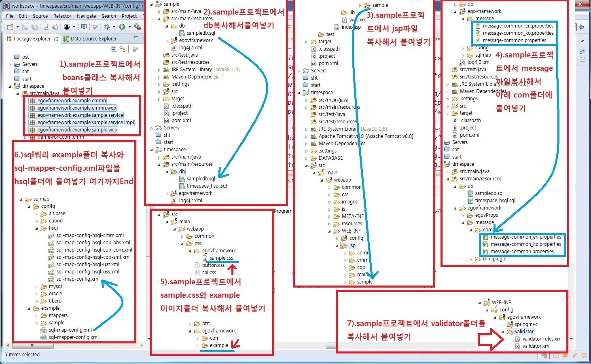

## 이전에 작업한 전자정부표준프레임웍(이하 egov로 표기)<br> 기반 CMS 에서 연동 SW 점검1 + 점검2.
***
전자정부 표준프레임워크 라이선스는 Apache 2.0 라이선스를 따릅니다.부트스트랩/AdminLTE/기타등등<br>
표준프레임워크 내에서 사용된 외부 오픈소스의 경우 원 오픈소스의 라이선스 정책을 유지합니다.
[라이센스 보기](https://www.egovframe.go.kr/EgovLicense.jsp)
***
### 아래 점검시 사용된 복사해서 붙여넣기는 기존 파일이 있을시 무조건 덮어 쓰시면 됩니다.

>작업일자(아래): 20200221
### 연동 SW 점검 2. egov sht프로젝트에서 -> CMS프로젝트 CRUD 연동검사 OK.
- egov 심플홈프로젝트 URL: http://sht.paas-ta.org/
- [결과확인 URL](http://sht.paas-ta.org/main/template/mainPage.do): http://sht.paas-ta.org/main/template/mainPage.do

### [ScreenShot 아래 1)번 부터 ~ 8)번 까지 실행했음.]<br>


### 연동 SW 점검 1. 작업한 CMS에서 -> egov Sample프로젝트 CRUD 연동검사 OK.
- [결과확인 URL](https://egov-timespace.herokuapp.com/egovSampleList.do): https://egov-timespace.herokuapp.com/egovSampleList.do
- 현재 Git 소스는 점검1. 결과가 적용된 소스 입니다. 원상복귀는 아래 스크린샷 7).번 부터 1).번까지 역순으로 처리하면 됩니다.
- sample 프로젝트에서 validator폴더복사해서 CMS프로젝트에 추가.
- context-validator.xml에서 Sample용 밸리데이터 설정 추가.(아래 스크린샷에서 7번에 딸린작업)
```xml
<bean id="validatorFactory" class="org.springmodules.validation.commons.DefaultValidatorFactory">
    <property name="validationConfigLocations">
        <list>
            <!-- 경량환경 템플릿 밸리데이터 설정 -->
            <value>classpath:/egovframework/validator/validator-rules-let.xml</value>
            <value>classpath:/egovframework/validator/let/**/*.xml</value>
            <!-- Sample용 밸리데이터 설정 추가 -->
            <value>/WEB-INF/config/egovframework/validator/validator-rules.xml</value>
            <value>/WEB-INF/config/egovframework/validator/validator.xml</value>
        </list>
    </property>
</bean>
```

>작업일자(아래): 20200220
### 연동 SW 점검 1. 표준프레임웍으로 구성된 프로젝트(게시판)을 CMS솔루션에 적용 특이사항.
```xml
context-datasource.xml파일에서 아래 내용 추가(아래 스크린샷에서 2번에 딸린작업)
<!-- hsql -->
<jdbc:embedded-database id="dataSource-hsql" type="HSQL">
	<jdbc:script location= "classpath:/db/shtdb.sql"/>
	<jdbc:script location= "classpath:/db/sampledb.sql"/><!-- 이부분 추가 -->
</jdbc:embedded-database>
sampledb.sql 내용 중에서 IDS는 기존값과 중복되기 때문에 제거
CREATE MEMORY TABLE IDS(TABLE_NAME VARCHAR(16) NOT NULL PRIMARY KEY,NEXT_ID DECIMAL(30) NOT NULL)
SET SCHEMA PUBLIC
```

### [ScreenShot 아래 1)번 부터 ~ 7)번 까지 실행했음.]<br>



### 추가한 패키지명 변경.
- 추가한 패키지 egov... 으로 시작 -> 추가한 패키지 timespace... 으로 시작  